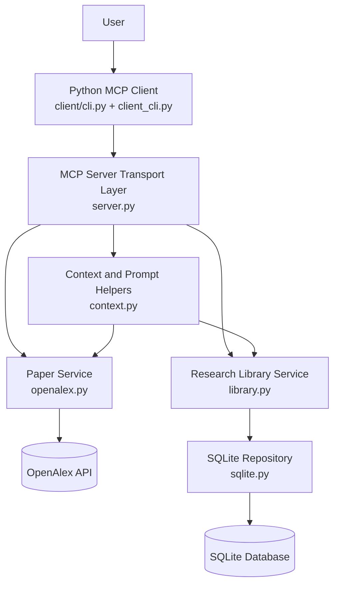
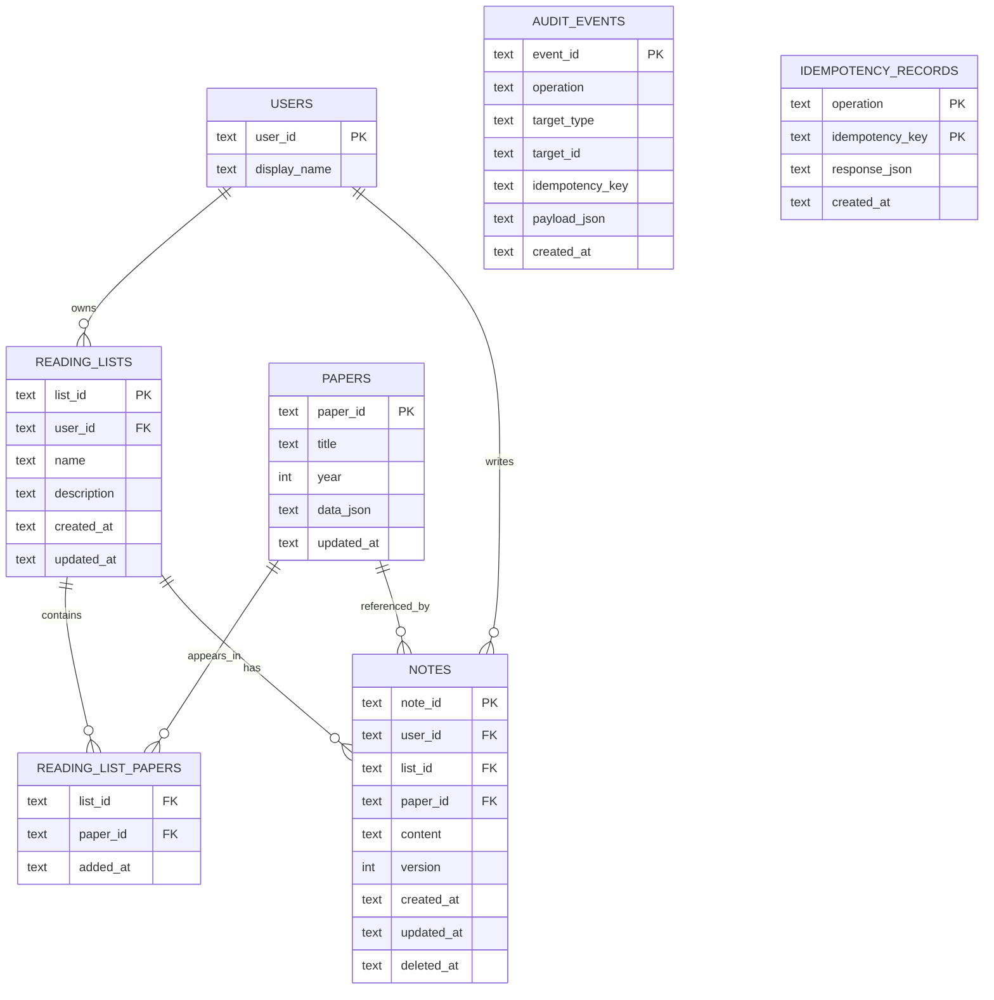
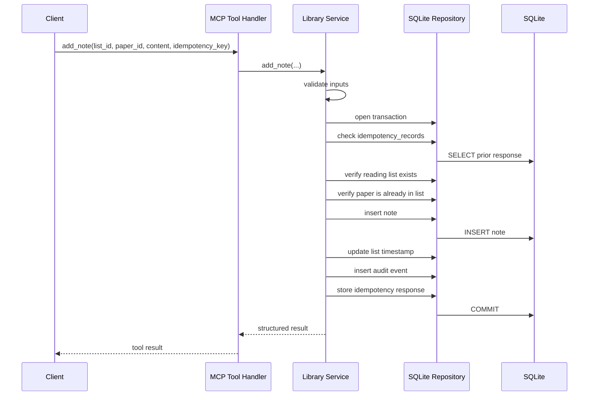
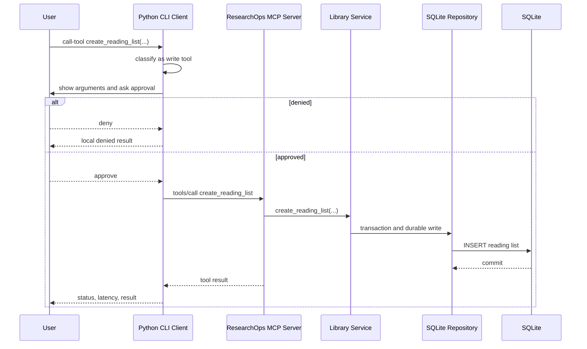
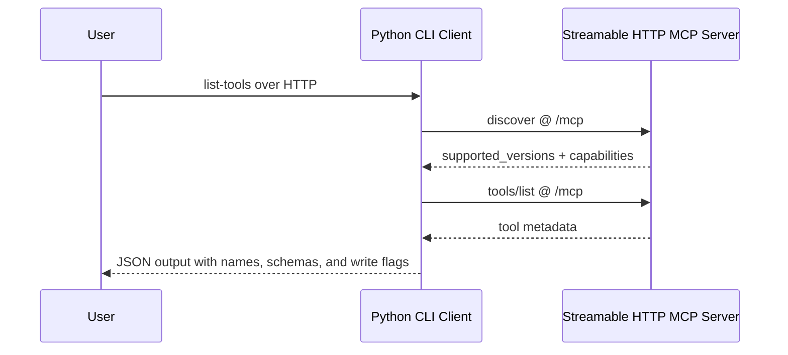
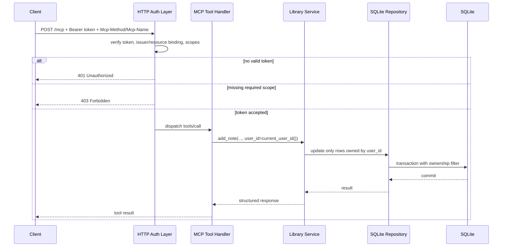

# ResearchOps MCP Design

## Purpose

This document records the design of the ResearchOps MCP project as it evolved through the roadmap.
It is organized day by day so the architecture and boundary changes are easy to review later.
The latest completed day appears at the end.

## Design Principles

- Keep the MCP interface stable even when the backing implementation changes.
- Separate transport, business logic, persistence, and external API access.
- Use tools for actions, resources for stable context, and prompts for reusable reasoning scaffolds.
- Keep write operations explicit and protected with validation, idempotency, and concurrency checks.
- Prefer simple local infrastructure first, then grow toward production architecture later.

## Current Architecture Snapshot

### Layer Summary

- Client layer: Python CLI for discovery, reads, prompts, tool calls, approval gating, and latency reporting.
- Transport layer: MCP tools, resources, and prompts exposed by the server over `stdio` or Streamable HTTP.
- Service layer: business rules, validation, idempotency, optimistic concurrency, and orchestration.
- Repository layer: SQLite schema, transactions, and durable reads and writes.
- External dependency layer: OpenAlex-backed paper lookup and search.

### File Ownership

- `src/researchops_mcp/server.py`: MCP transport layer and server factory.
- `src/researchops_mcp/services/openalex.py`: OpenAlex integration and paper normalization.
- `src/researchops_mcp/services/context.py`: resource and prompt rendering helpers.
- `src/researchops_mcp/services/library.py`: durable reading-list and note business logic.
- `src/researchops_mcp/repositories/sqlite.py`: SQLite persistence and transaction boundary.
- `src/researchops_mcp/client_cli.py`: packaged CLI client implementation.
- `client/cli.py`: thin roadmap-friendly client entry point.

### Current Capability Map

#### Tools

- `health_check`: server status and storage mode.
- `search_papers`: bounded OpenAlex paper search.
- `get_paper`: one normalized paper lookup.
- `export_bibtex`: one paper citation export.
- `create_reading_list`: create durable list state.
- `add_paper_to_list`: persist paper membership in a list.
- `add_note`: create a durable note tied to a list and paper.
- `update_note`: update a note with optimistic concurrency.
- `delete_note`: delete a note with confirmation and optimistic concurrency.

#### Resources

- `paper://{paper_id}`: stable paper context.
- `reading-list://{list_id}`: stable reading-list context backed by persistent storage.

#### Prompts

- `compare_papers`: reusable comparison scaffold.
- `generate_literature_review`: reusable literature-review scaffold.

### High-Level Diagram

## Day 3: OpenAlex Read Layer

### What Changed

Day 3 replaced mock paper results with a real OpenAlex-backed read path and introduced a dedicated citation-export tool.

### Design Decisions

#### Why OpenAlex

OpenAlex was chosen because it supports paper metadata search and lookup without adding early authentication or full-text complexity.
It is a good fit for:
- `search_papers`
- `get_paper`
- `export_bibtex`

#### Why Keep Citation Export Separate

`export_bibtex` is a separate tool because citation export is a distinct user goal with a different output contract.
This keeps `get_paper` narrow and avoids mode-heavy tool design.

### Day 3 Architecture Impact

- Introduced a paper service layer between MCP handlers and the upstream API.
- Added normalized paper shaping so MCP outputs stay stable even if upstream responses vary.
- Kept the server read-only at this stage.

## Day 4: Resources and Prompts

### What Changed

Day 4 introduced model-facing context primitives on top of the read-only server:
- stable resources
- reusable prompts
- temporary in-memory reading-list context

### Resource Design

#### `paper://{paper_id}`

This resource exposes one paper as stable MCP-readable context.
It exists so paper context can be reused without forcing every tool to return large payloads.

#### `reading-list://{list_id}`

This resource was introduced before persistence existed.
The design goal was to establish the correct MCP interface first, then change the backing store later.

### Prompt Design

- `compare_papers` provides reusable reasoning scaffolding for comparing two papers.
- `generate_literature_review` provides reusable literature-review scaffolding over selected papers.

Prompts stay separate from storage and retrieval logic.
They are model-facing templates, not backend action tools.

## Day 5: Persistence and Write Safety

### What Changed

Day 5 replaced temporary reading-list backing with SQLite persistence and introduced the first durable write tools.

### Why SQLite

SQLite was chosen for the local persistence phase because it keeps the dependency footprint small while still supporting:
- schema design
- transactions
- durable state
- idempotency storage
- optimistic concurrency

### Why a Repository Layer

The repository layer keeps SQL and database concerns separate from:
- MCP transport code
- business rules
- prompt and resource rendering logic

This makes the persistence logic easier to test and replace later.

### Why a Service Layer

The service layer owns business rules such as:
- validating idempotency keys
- checking that a paper is already in a reading list before allowing a note
- deciding when a retry should return a previous result
- checking stale note versions before updating or deleting

Those rules do not belong in SQL and do not belong in the MCP handler itself.

### Database Design

#### Tables

- `users`: local user identity placeholder for the current single-user phase.
- `papers`: normalized paper metadata cached locally once a paper enters persistent workflows.
- `reading_lists`: reading-list metadata.
- `reading_list_papers`: membership join table between lists and papers.
- `notes`: note content plus version and soft-delete fields.
- `audit_events`: durable record of write actions.
- `idempotency_records`: stored responses for retry-safe writes.

#### Database Diagram

### Read and Write Boundary

#### Reads

Reads should expose stable context and avoid unnecessary state changes.
Examples:
- `get_paper`
- `paper://{paper_id}`
- `reading-list://{list_id}`

#### Writes

Writes should be explicit tools because they change durable state.
Examples:
- `create_reading_list`
- `add_paper_to_list`
- `add_note`
- `update_note`
- `delete_note`

### Stable Interface vs Backing Implementation

One of the main Day 5 goals was preserving the external MCP contract while changing internal storage.

Example:
- Day 4: `reading-list://{list_id}` read from an in-memory service.
- Day 5: `reading-list://{list_id}` reads from SQLite.

The URI shape did not change. Only the internal resolution logic changed.
Clients should depend on the MCP interface contract, not on the storage implementation.

### Transactions, Idempotency, and Concurrency

#### Transactions

A Day 5 write is usually more than one SQL statement.
For example, `add_note` can require:
- verifying list existence
- verifying paper membership
- inserting the note
- updating the reading-list timestamp
- recording audit information
- recording idempotency output

These operations are grouped inside one transaction so partial writes do not leak into the database.

#### Idempotency

Idempotency protects against duplicate execution of the same write request.
The server stores prior responses keyed by logical operation and `idempotency_key` so safe retries do not duplicate state changes.

#### Optimistic Concurrency

Optimistic concurrency protects against stale updates overwriting newer state.
The note record keeps a version, and update or delete flows require `expected_version`.

### Request Flow: `add_note`

### Resource Rendering Design

#### `paper://{paper_id}`

This resource returns stable paper context based on normalized OpenAlex metadata.
It truncates long abstracts so resource reads remain model-friendly.

#### `reading-list://{list_id}`

This resource renders persistent state from SQLite.
It includes:
- list metadata
- paper references
- note previews
- bounded note content

## Day 6: Local CLI Client

### What Changed

Day 6 added a Python CLI client so the project can be exercised from the client side, not just the server side.

### Client Responsibilities

The client owns behavior that the server should not own:
- capability discovery
- listing tools, resource templates, and prompts
- reading resources
- invoking tools
- gating write tools behind client approval
- reporting status and latency

### Why Start With Local `stdio`

The Day 6 client launches the local server process directly with `python src/server.py` and communicates over `stdio`.
That keeps the learning scope narrow before adding HTTP, TLS, and deployment concerns.

### Discovery Versus Initialized Operations

One important Day 6 lesson was that capability discovery must stay separate from the initialized request path in this local setup.

Observed issue:
- the first client version called `initialize()` and then `discover()`
- the server rejected that combination with a protocol-level error about the `2026-07-28` discovery envelope

Final design:
- `discover` is handled before `initialize()`
- list and invocation operations use the initialized path

### Write Approval Policy

The current server does not yet expose richer structured annotations that cleanly label write tools.
For Day 6, the client therefore uses a small explicit local write-tool policy set:
- `create_reading_list`
- `add_paper_to_list`
- `add_note`
- `update_note`
- `delete_note`

When one of these tools is called:
1. the client prints the tool name
2. the client prints the parsed arguments
3. the client asks for approval unless `--yes` is set
4. the client either denies locally or forwards the call to the server

### Request Flow: `create_reading_list`

### Output Design

The client prints JSON for machine-readable review and revision-friendly inspection.
Each major action includes:
- operation name
- parsed arguments when relevant
- status
- latency in milliseconds
- returned content

## Day 7: Streamable HTTP and Staging Deployment

### What Changed

Day 7 added remote-style serving and the first public staging deployment.
The same MCP surface now works over both `stdio` and Streamable HTTP.

### Transport Strategy

Day 7 keeps one shared `MCPServer` capability factory and adds transport-aware startup instead of building a separate HTTP-only server.

Supported startup modes:
- `stdio`
- `streamable-http`

This avoids duplicating tool, resource, and prompt registration logic.

### Why One Server Factory Matters

The ResearchOps interface should stay stable across transports.
If `stdio` and HTTP were built by separate registration paths, drift would become more likely:
- tool descriptions could diverge
- prompt arguments could diverge
- resource shapes could diverge

Using one shared `create_server()` path avoids that class of problem.

### HTTP Serving Shape

The server now supports:
- `server.run(transport="streamable-http", ...)` for direct serving
- `create_streamable_http_app(...)` for ASGI app creation

That gives two deployment paths:
- direct local remote-style serving for verification
- future embedding behind other ASGI deployment setups

### HTTP-Aware Client Design

The Python client now supports:
- `--connection-mode stdio`
- `--connection-mode http`

In HTTP mode:
- the client reaches a running MCP URL
- `discover` works on the remote path
- later operations continue over the same HTTP transport without the old subprocess lifecycle assumption

### Request Flow: HTTP Tool Listing

### Deployment Shape

The Dockerfile currently:
- installs the package from the repository
- exposes port `8000`
- starts `python src/server.py --transport streamable-http --host 0.0.0.0 --stateless-http`
- relies on the `PORT` environment variable for the actual bound HTTP port in deployment environments such as Render

### Render Staging Notes

For the free Day 7 staging path, the project is prepared for Render with:
- `PORT`-driven HTTP binding
- `render.yaml` for a free Docker-based web service
- `DATABASE_PATH=/tmp/researchops.db` as explicit temporary staging storage
- a public MCP endpoint at `https://researchops-mcp.onrender.com/mcp`

Verified remote behaviors on 2026-08-25:
- `discover` returned the deployed server identity and protocol version
- `list-tools` returned the expected 9 tools with input schemas
- `health_check` confirmed OpenAlex plus SQLite staging storage
- `search_papers` returned live upstream OpenAlex results through the deployed MCP server

### Known Day 7 Gaps

- `/tmp/researchops.db` is ephemeral and cannot serve as production persistence.
- Reverse proxy and TLS posture are not yet implemented directly by the application.
- Supported AI host integration is still pending.

## Day 8: Authentication, Authorization, and Multi-User Boundaries

### What Changed

Day 8 added the first real remote access-control layer.
The server now supports authenticated HTTP requests, scoped authorization, and per-user data ownership for reading lists and notes.

### Auth Strategy

The Day 8 implementation uses the official MCP Python SDK auth surface instead of a custom header scheme.
For learning, the token verifier is local and deterministic:
- demo bearer tokens represent Alice and Bob
- each token carries explicit scopes
- the token is also bound to the configured resource server URL

This is intentionally not a full production OAuth deployment yet.
It teaches the correct MCP server boundary first.

### Scope Model

The first scope set is narrow and capability-oriented:
- `papers:read`
- `lists:read`
- `lists:write`
- `notes:write`

These scopes are mapped close to the MCP boundary:
- paper tools, paper resources, and prompts require `papers:read`
- reading-list resources require `lists:read`
- list creation and list membership writes require `lists:write`
- note writes require `notes:write`

### Identity Flow

Day 7 effectively behaved like a single-user server.
Day 8 changes that by deriving the effective `user_id` from the authenticated access token.
That `user_id` now flows through:
- MCP handler
- service layer
- repository layer
- SQLite ownership queries

This is the key design change that makes the application multi-user instead of only multi-token.

### Ownership Enforcement

Scopes alone are not enough.
A caller with `lists:read` should not automatically read every list in the database.
For that reason, ownership is enforced in the repository queries themselves.

Examples:
- `get_reading_list(list_id, user_id=...)` only returns rows owned by that user
- note update and delete paths only affect notes owned by that user
- cross-user access is hidden as not found at the application layer

That is safer than loading a foreign record first and then deciding later whether to reject it.

### HTTP Status Behavior

The remote auth contract now has two distinct rejection paths:
- missing or invalid bearer token: `401 Unauthorized`
- valid bearer token but insufficient scope: `403 Forbidden`

The server also returns `WWW-Authenticate` information so a client can understand why the request failed.

### Local `stdio` Versus Remote HTTP

Local `stdio` is still treated as the low-friction development path.
In that mode, the project can rely on local trust and environment configuration.
Remote HTTP is the protected resource boundary where bearer-token auth is enforced.

This split matches the MCP guidance that HTTP auth and local subprocess auth are not the same problem.

### Request Flow: Protected Write Tool

### Verification Added In Day 8

Automated verification now covers:
- `401` when HTTP auth is missing
- `401` when the bearer token is invalid
- `403` when the bearer token is valid but lacks the required scope
- cross-user list and note access blocked at the service and repository layers
- full project regression suite still passing after auth was introduced

Manual verification also confirmed:
- Alice can create and read her own list
- Bob cannot read Alice's list
- Bob read-only token cannot call `add_note`
- unauthenticated HTTP access is rejected

## Testing Notes Through Day 8

### Unit and Integration Focus

- service-level idempotency behavior
- stale version conflict handling
- note precondition validation
- client argument parsing and transport setup
- local HTTP server setup and transport configuration

### Manual Verification Focus

- MCP Inspector verified the Day 4 resource and prompt flows.
- MCP Inspector verified the Day 5 write flows.
- CLI verification covered Day 6 discovery, reads, writes, and tool-error handling.
- CLI and Inspector both verified Day 7 Streamable HTTP behavior locally and against Render staging.
- Day 8 added automated HTTP auth tests for 401 and 403, plus manual Alice and Bob ownership checks.

## Known Current Limitations

- SQLite is still embedded local storage and is not yet a production multi-instance persistence layer.
- `/tmp/researchops.db` on Render is temporary staging storage only.
- The CLI still summarizes some raw HTTP auth failures as generic transport errors instead of always surfacing the exact HTTP status directly.
- Demo reading lists are still seeded automatically for learning convenience.

## Related Documents

- `docs/tracker.md`
- `docs/learning.md`
- `docs/decisions.md`
- `docs/project-spec.md`
- `docs/threat-model.md`

