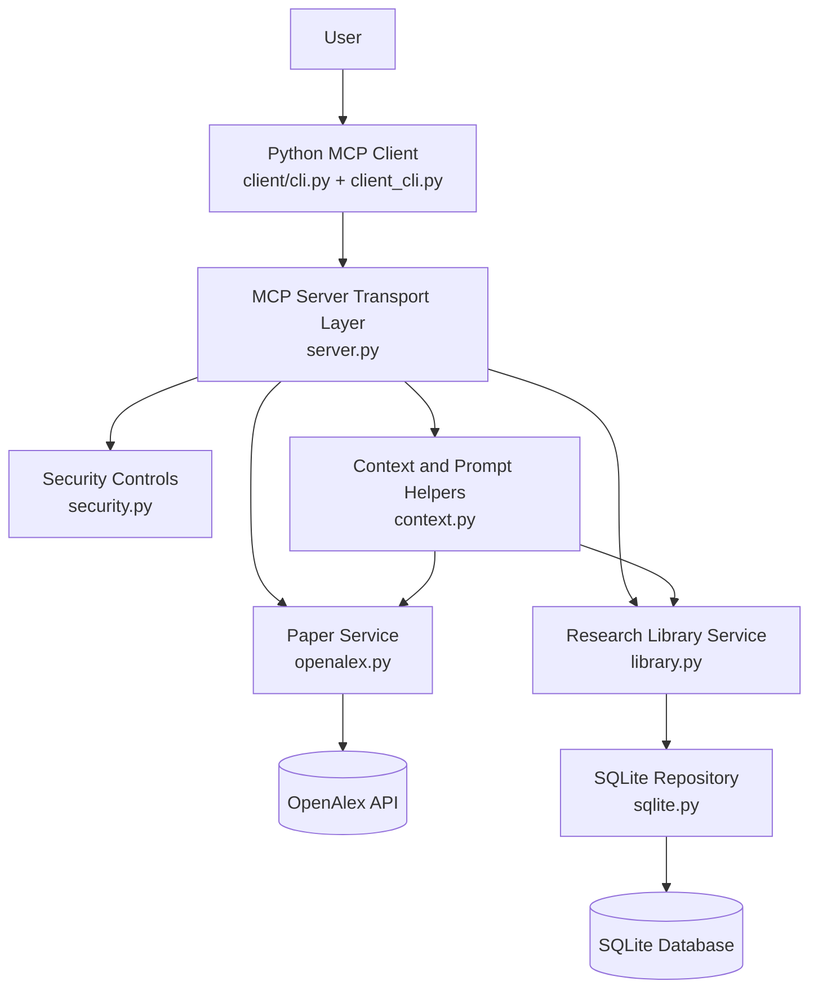
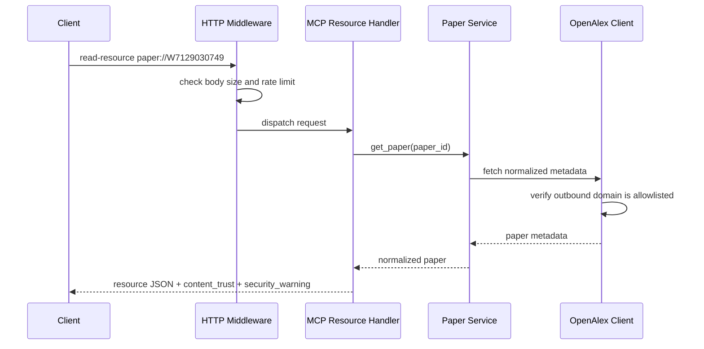
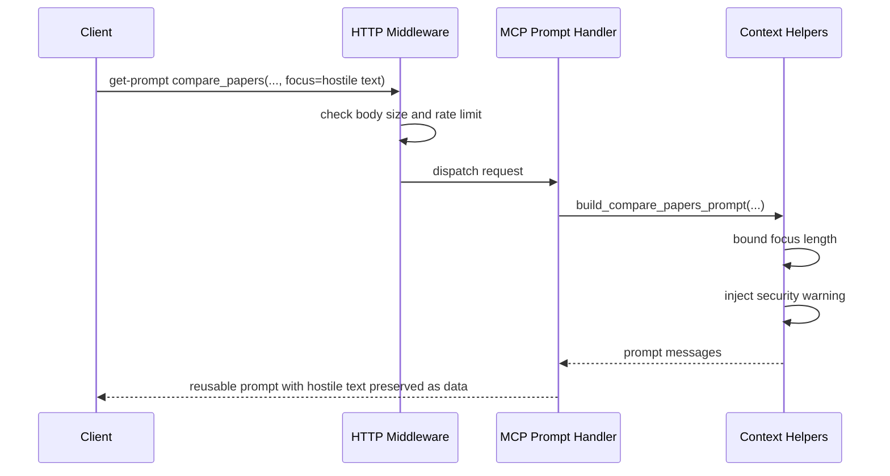

# ResearchOps MCP Design

## Purpose

This document records the design of the ResearchOps MCP project as it evolved through the roadmap.
It is organized day by day so the architecture and boundary changes are easy to review later.
The latest completed day appears at the end.

## Design Principles

- Keep the MCP interface stable even when the backing implementation changes.
- Separate transport, business logic, persistence, and external API access.
- Use tools for actions, resources for stable context, and prompts for reusable reasoning scaffolds.
- Keep write operations explicit and protected with validation, idempotency, and concurrency checks.
- Prefer simple local infrastructure first, then grow toward production architecture later.

## Current Architecture Snapshot

### Layer Summary

- Client layer: Python CLI for discovery, reads, prompts, tool calls, approval gating, and latency reporting.
- Transport layer: MCP tools, resources, and prompts exposed by the server over `stdio` or Streamable HTTP.
- Service layer: business rules, validation, idempotency, optimistic concurrency, and orchestration.
- Repository layer: SQLite schema, transactions, and durable reads and writes.
- External dependency layer: OpenAlex-backed paper lookup and search.
- Security layer: HTTP middleware, outbound controls, trust labeling, and validation limits.

### File Ownership

- `src/researchops_mcp/server.py`: MCP transport layer and server factory.
- `src/researchops_mcp/security.py`: shared security controls and middleware.
- `src/researchops_mcp/services/openalex.py`: OpenAlex integration and paper normalization.
- `src/researchops_mcp/services/context.py`: resource and prompt rendering helpers.
- `src/researchops_mcp/services/library.py`: durable reading-list and note business logic.
- `src/researchops_mcp/repositories/sqlite.py`: SQLite persistence and transaction boundary.
- `src/researchops_mcp/client_cli.py`: packaged CLI client implementation.
- `client/cli.py`: thin roadmap-friendly client entry point.

### Current Capability Map

#### Tools

- `health_check`: server status and storage mode.
- `search_papers`: bounded OpenAlex paper search.
- `get_paper`: one normalized paper lookup.
- `export_bibtex`: one paper citation export.
- `create_reading_list`: create durable list state.
- `add_paper_to_list`: persist paper membership in a list.
- `add_note`: create a durable note tied to a list and paper.
- `update_note`: update a note with optimistic concurrency.
- `delete_note`: delete a note with confirmation and optimistic concurrency.

#### Resources

- `paper://{paper_id}`: stable paper context.
- `reading-list://{list_id}`: stable reading-list context backed by persistent storage.

#### Prompts

- `compare_papers`: reusable comparison scaffold.
- `generate_literature_review`: reusable literature-review scaffold.

### High-Level Diagram

## Day 3: OpenAlex Read Layer

### What Changed

Day 3 replaced mock paper results with a real OpenAlex-backed read path and introduced a dedicated citation-export tool.

### Design Decisions

#### Why OpenAlex

OpenAlex was chosen because it supports paper metadata search and lookup without adding early authentication or full-text complexity.
It is a good fit for:
- `search_papers`
- `get_paper`
- `export_bibtex`

#### Why Keep Citation Export Separate

`export_bibtex` is a separate tool because citation export is a distinct user goal with a different output contract.
This keeps `get_paper` narrow and avoids mode-heavy tool design.

### Day 3 Architecture Impact

- Introduced a paper service layer between MCP handlers and the upstream API.
- Added normalized paper shaping so MCP outputs stay stable even if upstream responses vary.
- Kept the server read-only at this stage.

## Day 4: Resources and Prompts

### What Changed

Day 4 introduced model-facing context primitives on top of the read-only server:
- stable resources
- reusable prompts
- temporary in-memory reading-list context

### Resource Design

#### `paper://{paper_id}`

This resource exposes one paper as stable MCP-readable context.
It exists so paper context can be reused without forcing every tool to return large payloads.

#### `reading-list://{list_id}`

This resource was introduced before persistence existed.
The design goal was to establish the correct MCP interface first, then change the backing store later.

### Prompt Design

- `compare_papers` provides reusable reasoning scaffolding for comparing two papers.
- `generate_literature_review` provides reusable literature-review scaffolding over selected papers.

Prompts stay separate from storage and retrieval logic.
They are model-facing templates, not backend action tools.

## Day 5: Persistence and Write Safety

### What Changed

Day 5 replaced temporary reading-list backing with SQLite persistence and introduced the first durable write tools.

### Why SQLite

SQLite was chosen for the local persistence phase because it keeps the dependency footprint small while still supporting:
- schema design
- transactions
- durable state
- idempotency storage
- optimistic concurrency

### Why a Repository Layer

The repository layer keeps SQL and database concerns separate from:
- MCP transport code
- business rules
- prompt and resource rendering logic

This makes the persistence logic easier to test and replace later.

### Why a Service Layer

The service layer owns business rules such as:
- validating idempotency keys
- checking that a paper is already in a reading list before allowing a note
- deciding when a retry should return a previous result
- checking stale note versions before updating or deleting

Those rules do not belong in SQL and do not belong in the MCP handler itself.

## Day 6: Local CLI Client

### What Changed

Day 6 added a Python CLI client so the project can be exercised from the client side, not just the server side.

### Client Responsibilities

The client owns behavior that the server should not own:
- capability discovery
- listing tools, resource templates, and prompts
- reading resources
- invoking tools
- gating write tools behind client approval
- reporting status and latency

## Day 7: Streamable HTTP and Staging Deployment

### What Changed

Day 7 added remote-style serving and the first public staging deployment.
The same MCP surface now works over both `stdio` and Streamable HTTP.

### Transport Strategy

Day 7 keeps one shared `MCPServer` capability factory and adds transport-aware startup instead of building a separate HTTP-only server.

## Day 8: Authentication, Authorization, and Multi-User Boundaries

### What Changed

Day 8 added the first real remote access-control layer.
The server now supports authenticated HTTP requests, scoped authorization, and per-user data ownership for reading lists and notes.

### Key Boundary

Scopes are enforced near the MCP boundary, while ownership is enforced at the repository query boundary.
That prevents cross-user access even when a caller has a broad read scope.

## Day 9: Security Hardening and Adversarial Boundaries

### What Changed

Day 9 kept the same MCP surface and hardened how the server handles hostile inputs, hostile model-facing content, and abusive HTTP traffic.

### New Security Module

A dedicated `security.py` module now centralizes controls that should not be scattered across unrelated tool handlers.
It currently owns:

- outbound URL allowlisting
- request-size enforcement
- fixed-window rate limiting
- log redaction helpers
- shared trust-warning constants and input-size constants

### Boundary Placement

#### Transport Middleware

The Streamable HTTP app now adds middleware before MCP request dispatch:

- `RequestSizeLimitMiddleware` rejects oversized HTTP bodies early with `413`
- `RateLimitMiddleware` rejects abusive request frequency with `429`
- Day 8 auth and scope middleware still run on the protected HTTP path

These controls belong at the HTTP boundary because they protect the whole service regardless of which tool or resource is being targeted.

#### Service-Level Validation

Business-specific bounds remain inside the service layer.
Examples:

- search query length
- reading-list name and description length
- note content length
- prompt focus and objective length

These checks belong with business rules because they are about semantic limits, not only raw transport safety.

#### External Dependency Boundary

The OpenAlex client now validates the final outbound URL against an explicit domain allowlist before performing the request.
Today the allowlist defaults to `api.openalex.org`.
That keeps the intended dependency boundary explicit and makes future SSRF-style mistakes easier to catch.

#### Model-Facing Boundary

Paper resources, reading-list resources, and prompt templates now add explicit trust metadata.
The current pattern is:

- `content_trust` field on model-facing documents
- `security_warning` field telling the model to treat paper metadata and notes as evidence, not instructions
- preserved hostile text as data rather than silently deleting it

This matters because the MCP server is not only an API layer. It is also a model-facing context layer.

### Request Flow: Hardened Paper Resource Read

### Request Flow: Hardened Prompt Construction

### Verification Added In Day 9

Automated tests now cover:

- non-OpenAlex outbound target rejection
- oversized query rejection
- oversized note rejection
- trust labeling on paper resources
- security warning inclusion in prompts
- sensitive-field redaction
- oversized HTTP body rejection
- HTTP rate limiting

Manual CLI verification on August 29, 2026 confirmed:

- `paper://W7129030749` returns `content_trust=untrusted_external_data`
- the paper resource includes a visible `security_warning`
- `compare_papers` includes hostile focus text but also the explicit security note
- repeated authenticated requests hit the configured rate limit
- Bob still cannot access Alice's list because Day 8 ownership enforcement remains underneath Day 9 hardening

### Known Limitations After Day 9

- rate limiting is in-memory and therefore single-process only
- the outbound allowlist is domain-based and intentionally simple
- the CLI still reports some HTTP rejections as generic transport errors
- the server does not yet use a centralized audit viewer or external SIEM pipeline
