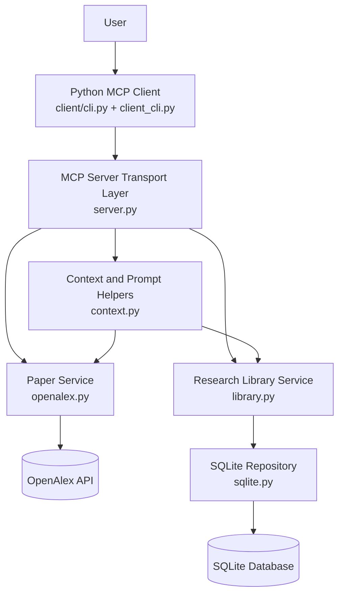
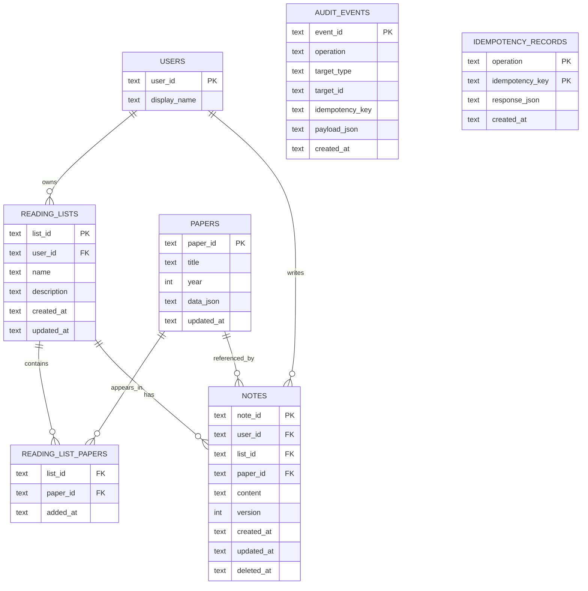
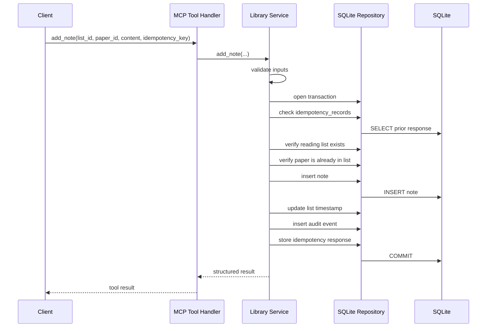
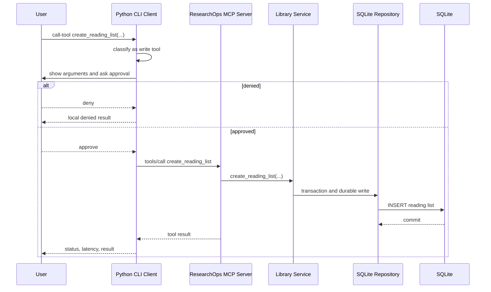

# ResearchOps MCP Design

## Purpose

This document captures the evolving technical design of the ResearchOps MCP project.
It is meant to be updated as the project progresses so the architecture, boundaries,
and major request flows stay easy to review later.

Current design state:
- Day 3 introduced a real OpenAlex-backed read-only paper layer.
- Day 4 introduced stable resources and reusable prompts.
- Day 5 introduced SQLite persistence, a repository layer, and safe write operations.
- Day 6 introduced a local Python CLI client for discovery, reads, prompts, and approval-gated write calls.

## Design Principles

- Keep the MCP interface stable even when the backing implementation changes.
- Separate transport, business logic, persistence, and external API access.
- Use tools for actions, resources for stable context, and prompts for reusable reasoning scaffolds.
- Keep write operations explicit and protected with validation, idempotency, and concurrency checks.
- Prefer simple local infrastructure first, then grow toward production architecture later.

## Current Architecture

### Layer Summary

- Client layer: local Python CLI for discovery, reads, prompts, tool calls, approval gating, and latency reporting.
- Transport layer: MCP tools, resources, and prompts exposed by the server.
- Service layer: business rules, validation, idempotency, optimistic concurrency, and orchestration.
- Repository layer: SQLite schema, transactions, and durable reads/writes.
- External dependency layer: OpenAlex-backed paper lookup and search.

### File Ownership

- `src/researchops_mcp/server.py`: MCP transport layer and server factory.
- `src/researchops_mcp/services/openalex.py`: OpenAlex integration and paper normalization.
- `src/researchops_mcp/services/context.py`: resource/prompt rendering helpers.
- `src/researchops_mcp/services/library.py`: Day 5 durable reading-list and note business logic.
- src/researchops_mcp/repositories/sqlite.py: SQLite persistence and transaction boundary.
- src/researchops_mcp/client_cli.py: packaged Day 6 stdio client implementation with discovery, reads, prompts, tool calls, and approval flow.
- client/cli.py: thin roadmap-friendly client entry point.

## High-Level Diagram

## MCP Capability Map

### Tools

- `health_check`: server status and storage mode.
- `search_papers`: bounded OpenAlex paper search.
- `get_paper`: one normalized paper lookup.
- `export_bibtex`: one paper citation export.
- `create_reading_list`: create durable list state.
- `add_paper_to_list`: persist paper membership in a list.
- `add_note`: create a durable note tied to a list and paper.
- `update_note`: update a note with optimistic concurrency.
- `delete_note`: delete a note with confirmation and optimistic concurrency.

### Resources

- `paper://{paper_id}`: stable paper context.
- `reading-list://{list_id}`: stable reading-list context backed by persistent storage.

### Prompts

- `compare_papers`: reusable comparison scaffold.
- `generate_literature_review`: reusable literature-review scaffold.

## Day 5 Design Decisions

### Why SQLite

SQLite was chosen for local persistence because it matches the roadmap's local-development phase and keeps the dependency footprint small. It is enough to learn:
- schema design
- transactions
- durable state
- idempotency storage
- optimistic concurrency

PostgreSQL is still a later deployment target, but adding it now would introduce infrastructure complexity before the persistence concepts are fully learned.

### Why a Repository Layer

The repository layer exists so SQL and database concerns stay separate from:
- MCP transport code
- business rules
- prompt/resource rendering logic

This makes the code easier to test and easier to replace later if the storage backend changes.

### Why a Service Layer

The service layer owns business rules such as:
- validating idempotency keys
- checking that a paper is already in a reading list before allowing a note
- deciding when a retry should return a previous result
- checking stale note versions before updating or deleting

Those rules do not belong in SQL and do not belong in the MCP handler itself.

## Database Design

### Tables

- `users`: local user identity for the current single-user phase.
- `papers`: normalized paper metadata cached locally once a paper enters persistent workflows.
- `reading_lists`: reading-list metadata.
- `reading_list_papers`: membership join table between lists and papers.
- `notes`: note content plus version and soft-delete fields.
- `audit_events`: durable record of write actions.
- `idempotency_records`: stored responses for retry-safe writes.

### Database Diagram

## Read and Write Boundary

### Reads

Reads should expose stable context and avoid unnecessary state changes.

Examples:
- `get_paper`
- `paper://{paper_id}`
- `reading-list://{list_id}`

### Writes

Writes should be explicit tools because they change durable state.

Examples:
- `create_reading_list`
- `add_paper_to_list`
- `add_note`
- `update_note`
- `delete_note`

This boundary matters because reads and writes need different validation, logging, and safety expectations.

## Stable Interface vs Backing Implementation

One of the main Day 5 design goals was preserving the external MCP contract while changing internal storage.

Example:
- Day 4: `reading-list://{list_id}` read from an in-memory service.
- Day 5: `reading-list://{list_id}` reads from SQLite.

The URI shape did not change.
Only the internal resolution logic changed.

That is intentional because clients should depend on the MCP interface contract, not on the storage implementation.

## Transactions

A Day 5 write is usually more than one SQL statement.
For example, `add_note` can require:
- verifying list existence
- verifying paper membership
- inserting the note
- updating the reading-list timestamp
- recording audit information
- recording idempotency output

These operations are grouped inside one transaction so partial writes do not leak into the database.

## Idempotency and Concurrency

### Idempotency

Idempotency protects against duplicate execution of the same write request.

Typical case:
- a client sends a write
- the write succeeds
- the client times out and retries
- the server should not perform the write again

This is handled by:
- validating `idempotency_key`
- checking `idempotency_records`
- returning the stored response when the same logical request is retried

### Optimistic Concurrency

Optimistic concurrency protects against stale updates overwriting newer state.

Typical case:
- one caller reads note version 1
- another caller updates the note to version 2
- the first caller tries to update using stale knowledge

This is handled by:
- storing `version` on notes
- requiring `expected_version` on update/delete
- rejecting stale writes with a conflict

### Why Both Are Needed

They solve different problems:
- idempotency = do not apply the same request twice
- optimistic concurrency = do not overwrite newer state with stale state

## Request Flow: `add_note`

### Summary

`add_note` is the clearest Day 5 example because it exercises validation, transactions, durable writes, and audit/idempotency behavior.

### Sequence Diagram

### Step-by-Step Explanation

1. The MCP tool handler receives the arguments.
2. The handler delegates immediately to the library service.
3. The service validates `list_id`, `paper_id`, `content`, and `idempotency_key`.
4. The service opens a repository transaction.
5. The service checks whether this `idempotency_key` already has a stored result.
6. The service verifies that the target reading list exists.
7. The service verifies that the paper is already part of the list.
8. The repository inserts the note with `version = 1`.
9. The reading list timestamp is updated.
10. An audit record is inserted.
11. The response is stored in `idempotency_records`.
12. The transaction commits.
13. The structured tool result is returned through MCP.

### Why the Flow Is Designed This Way

- validation happens before touching the database unnecessarily
- idempotency is checked before performing the write
- transaction wraps every state change
- audit and idempotency metadata are stored as part of the same durable workflow
- the MCP handler stays thin

## Resource Rendering Design

### `paper://{paper_id}`

This resource returns stable paper context based on normalized OpenAlex metadata.
It truncates long abstracts so resource reads remain model-friendly.

### `reading-list://{list_id}`

This resource now renders persistent state from SQLite.
It includes:
- list metadata
- paper references
- note previews
- bounded note content

It avoids returning unbounded full note bodies so the resource remains useful for the model rather than bloated.

## Prompt Design

Prompts remained intentionally separate from storage logic.

- `compare_papers` only needs stable paper URIs and focus instructions.
- `generate_literature_review` only needs a topic, objective, and paper URIs.

They remain reusable reasoning scaffolds rather than turning into data-fetching tools.

## Day 6 Client Design

### Client Responsibilities

The Day 6 client is intentionally small, but it owns important MCP behavior that the server should not own:
- capability discovery
- listing tools, resource templates, and prompts
- reading resources
- invoking tools
- gating write tools behind client approval
- reporting status and latency

This matters because MCP is not only about exposing server functions. The client determines how the server surface is discovered and used.

### Why The Client Uses Local Stdio First

The Day 6 client launches the local server process directly with `python src/server.py` and communicates over stdio.
That keeps the learning scope narrow:
- no HTTP transport yet
- no TLS or reverse proxy concerns yet
- no remote auth yet
- direct focus on MCP message flow and client behavior

### Discovery Versus Initialized Operations

One important Day 6 lesson was that capability discovery must stay separate from the initialized request path in this local setup.

Observed issue:
- the first client version called `initialize()` and then `discover()`
- the server rejected that combination with a protocol-level error about the 2026-07-28 discovery envelope

Final design:
- `discover` is handled before `initialize()`
- list and invocation operations use the initialized path

This is a real client-side protocol nuance, not just an implementation detail.

### Write Approval Policy

The current server does not yet expose richer structured annotations that cleanly label write tools.
For Day 6, the client therefore uses a small explicit local write-tool policy set:
- `create_reading_list`
- `add_paper_to_list`
- `add_note`
- `update_note`
- `delete_note`

When one of these tools is called:
1. the client prints the tool name
2. the client prints the parsed arguments
3. the client asks for approval unless `--yes` is set
4. the client either denies locally or forwards the call to the server

This is a temporary but clear policy until later metadata or richer host controls exist.

### Request Flow: `create_reading_list` Through The Client

### Output Design

The client prints JSON for machine-readable review and revision-friendly inspection.
Each major action includes:
- operation name
- parsed arguments when relevant
- status
- latency in milliseconds
- returned content

That keeps the client useful both for manual learning and for future scripted checks.
## Testing Strategy Through Day 5

### Unit Tests

- context rendering helpers
- service-level idempotency behavior
- stale version conflict handling
- note precondition validation

### MCP-Level Tests

- create list through MCP
- add paper through MCP
- add note through MCP
- read the updated reading-list resource
- fail delete without confirmation

### Manual Verification

Inspector was used to confirm:
- resources and prompts from Day 4 still work after persistence landed
- Day 5 write tools behave correctly with real request/response flow

## Known Current Limitations

- SQLite is local-only and single-user for now.
- `users` is still a placeholder for the current local phase.
- authorization is not yet implemented; Day 8 will address that.
- demo reading lists are still seeded automatically for learning convenience.

## How To Update This File Daily

Update this file whenever the design meaningfully changes.
Examples:
- new layers or modules are added
- resource or tool boundaries change
- storage strategy changes
- security boundaries change
- request flow changes
- deployment architecture changes

Minimum daily update rule:
- add or revise the relevant section for the current day
- update diagrams if architecture shape changed
- record new request flows when a new important workflow is introduced

## Related Documents

- `docs/tracker.md`
- `docs/learning.md`
- `docs/decisions.md`
- `docs/project-spec.md`
- `docs/threat-model.md`

