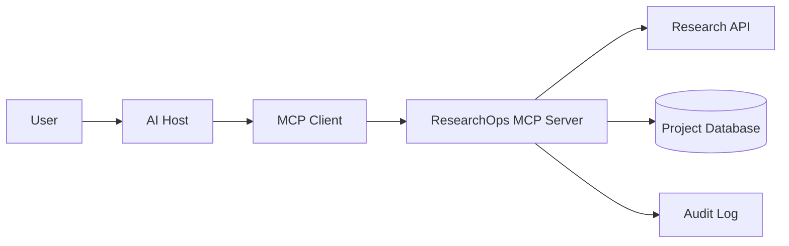

# ResearchOps MCP Project Specification

## Purpose

ResearchOps MCP will provide a safe, model-facing interface for research discovery and lightweight research workflow management. It will wrap external paper-search APIs and local persistence behind MCP primitives that an AI host can discover and invoke.

## Problem Statement

General-purpose assistants can search the web, but research workflows need more structure:

- bounded paper search results instead of noisy scraping
- stable paper identifiers
- reusable comparison workflows
- explicit write operations for notes and reading lists
- auditable and authorized actions for multi-user remote use

## User Roles

- Researcher: searches papers, reads metadata, maintains reading lists, writes notes
- Reviewer or collaborator: may read shared lists or notes depending on authorization policy
- Host application operator: configures which servers are available and what approvals are required
- MCP server operator: deploys and secures the backend service

## High-Level Requirements

### Functional requirements

- Search papers by query with bounded result size
- Retrieve a paper by stable identifier
- Expose selected paper and reading-list context as resources
- Create and manage reading lists
- Add, update, and delete notes with explicit write boundaries
- Export citations in BibTeX
- Support prompts for paper comparison and literature-review drafting
- Support long-running workflows only when the operation is genuinely asynchronous

### Non-functional requirements

- Clear input and output schemas
- Read and write separation
- Timeout handling for external API calls
- Structured errors
- Authorization checks on every protected operation
- Auditable writes
- Small, reviewable responses with pagination where needed
- Compatibility with local `stdio` and remote Streamable HTTP transports

## MCP Primitive Mapping

| Need | MCP primitive | Why |
|---|---|---|
| Search for papers | Tool: `search_papers` | This is a parameterized operation with bounded results |
| Get paper details | Tool: `get_paper` | Action-oriented fetch by stable ID |
| Re-read a specific paper context | Resource: `paper://{paper_id}` | Stable identifiable context |
| Re-read a reading list | Resource: `reading-list://{list_id}` | Stable identifiable context |
| Compare papers | Prompt: `compare_papers` | Reusable prompt template with typed arguments |
| Generate literature review draft | Prompt: `generate_literature_review` | Reusable prompt template |
| Create list or note | Tool | Consequential write operations need explicit invocation |
| Longer literature crawl/export job | Task | Only if the operation outlives a normal request |

## Initial Tool Candidates

- `health_check`
- `search_papers`
- `get_paper`
- `export_bibtex`
- `create_reading_list`
- `add_paper_to_list`
- `add_note`
- `update_note`
- `delete_note`

## Data Flow

### Request path

1. User asks the host to perform a research task.
2. The host decides whether the request may use ResearchOps MCP.
3. The MCP client discovers capabilities or directly invokes a tool.
4. The server validates input and enforces authorization.
5. The server reads from the research API or database, or performs a bounded write.
6. The server returns structured results, errors, or later resource identifiers.

## Trust Boundaries

1. User and host boundary:
   The host owns user identity, consent flow, and client-side approval policy.
2. Host/client and MCP server boundary:
   The server must treat every request as untrusted even if it came through a trusted host.
3. MCP server and external research API boundary:
   External content can be malicious, incomplete, or prompt-injecting.
4. MCP server and database boundary:
   Authorization must be enforced before persistence or retrieval of protected data.
5. Operator boundary:
   Deployment, logging, and secrets management must avoid exposing user data or tokens.

## Initial Threat Assumptions

- Tool arguments may be malformed or malicious.
- Research paper metadata may contain prompt-injection attempts.
- Remote callers may attempt unauthorized writes or cross-tenant reads.
- Large responses may be used to exhaust context or system resources.
- External dependencies may fail, time out, or rate-limit requests.

## Day 1 Completion Criteria

- Project requirements are written
- MCP primitive boundaries are identified
- End-to-end flow is documented
- Trust boundaries are named
- Threat-model outline exists
